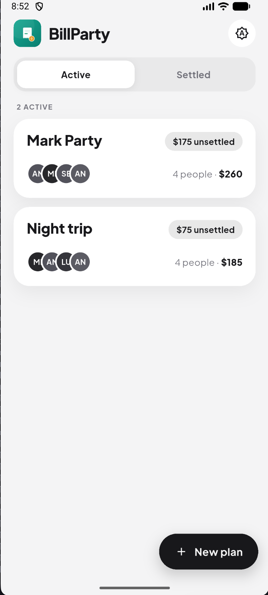
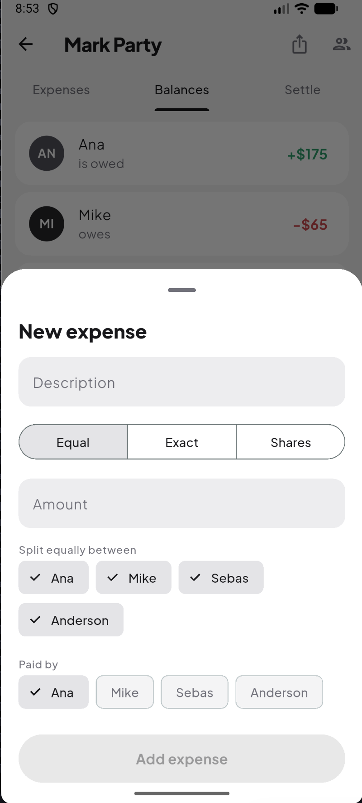
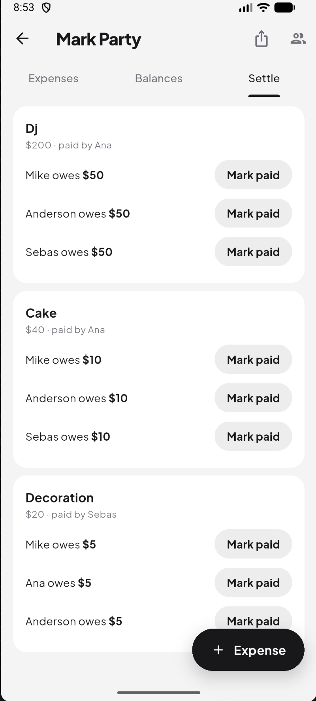
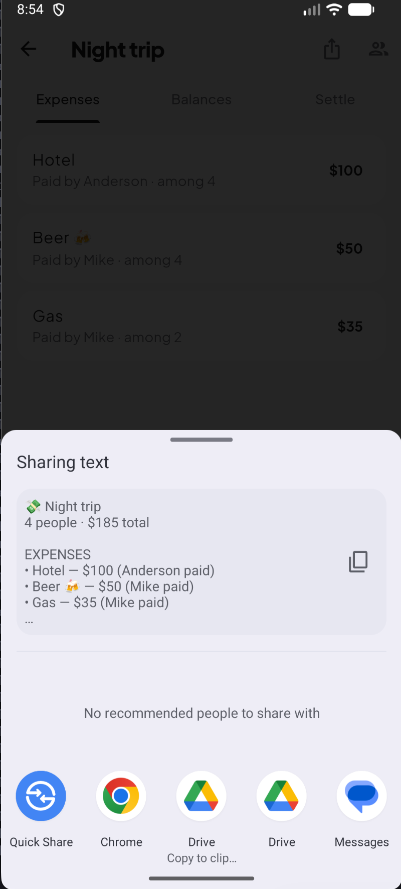

# BillParty

> Split group expenses without anyone having to sign up. Offline-first, no backend, no accounts — your data never leaves the phone.

[](LICENSE)
[](https://flutter.dev)
[](#)
[](#)
[](https://github.com/JuansesDev/billparty/releases/latest)

**BillParty** is a small app for splitting shared expenses across a group — a trip, a flat, a night out. One person (the *organizer*) installs it and keeps the group's accounts. There are no accounts to create, no servers, and no cloud.

*Tagline: "Split the bill, keep the party going."*

## Screenshots

<p align="center">
  
  
  
  
</p>

## Why

When several people share expenses, tracking them on paper is tedious and error-prone, and existing apps **force everyone to create an account**. BillParty removes that friction: **only the organizer installs the app**, and everyone else just receives a summary to read.

This isn't an accidental limitation — it's the whole point. Keeping the state on a single device is exactly what makes BillParty **100% offline and a good fit for F-Droid**, and it's the main difference from tools like Splitwise.

## Features

- **Plans** — a group/event with its own people and expenses (e.g. "Trip to Cartagena").
- **Flexible splitting** — split an expense *equally*, by *exact amounts* (each person pays for what they ordered), or by *shares* (e.g. "the couple counts double").
- **Edit & delete** — tap an expense to edit it, swipe to delete it.
- **Balances** — see at a glance who is owed and who owes, in green and red.
- **Settle per expense** — mark each person's share as paid, in full or partially; the plan closes once everyone's covered.
- **Share a snapshot** — export an itemized text summary (expenses, balances, who pays whom). No live sync, no servers.
- **Light & dark** — a clean monochrome theme that remembers your choice.
- **Exact money** — amounts are stored as integers, so balances are always exact (no floating-point drift).

## Install

- **Android APK:** download the latest signed build from [GitHub Releases](https://github.com/JuansesDev/billparty/releases/latest).
- **F-Droid / IzzyOnDroid:** coming soon.

## Privacy by design

- **Offline-first** — works in airplane mode, always.
- **No accounts** — open the app and use it.
- **No network** — no analytics, no ads, no trackers; the data never leaves your device. There is nothing to leak.

See [PRIVACY.md](PRIVACY.md) for the full policy.

## Tech stack

- **Flutter** + **Dart** — cross-platform UI (Android & iOS).
- **SQLite** — local, multi-plan persistence.
- **Riverpod** — state management.
- **Hexagonal architecture** — a pure domain at the core, with infrastructure (database, sharing) at the edges.
- **Tested domain** — the money math (splitting, balances, debt simplification) is covered by unit and property-based tests.

All dependencies are free and open source — no Google Play Services, no proprietary SDKs.

## Architecture

The domain knows nothing about Flutter or SQLite. The rules that must always hold live in the center; the database and UI are just details at the boundary.

```
lib/
├─ domain/          ← pure business logic (models, splitting, balances, settle-up)
├─ application/     ← use cases that orchestrate the domain (+ Riverpod providers)
├─ infrastructure/  ← SQLite repositories
└─ ui/              ← screens and widgets
```

## Getting started

```bash
flutter pub get
flutter run
```

Requires the [Flutter SDK](https://docs.flutter.dev/get-started/install).

## Roadmap

- [x] MVP: plans, people, expenses, the three split modes, balances and settle-up.
- [x] Edit / delete expenses, per-expense settle-up with partial payments.
- [x] Share an itemized text summary.
- [x] Light & dark themes (persisted).
- [x] Signed release (`v1.0.0`) on GitHub.
- [ ] Distribution via F-Droid / IzzyOnDroid (in progress).
- [ ] Multi-currency, JSON backup/restore.

## Contributing

Contributions are welcome. BillParty is community-owned and intentionally simple — adding a feature should mean adding a small, well-tested piece, not rewiring the core.

## License

Released under the [MIT License](LICENSE).
